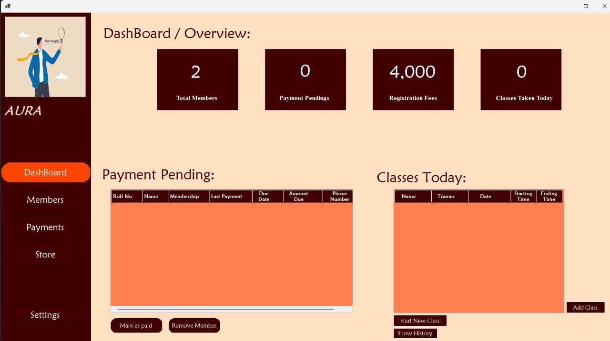
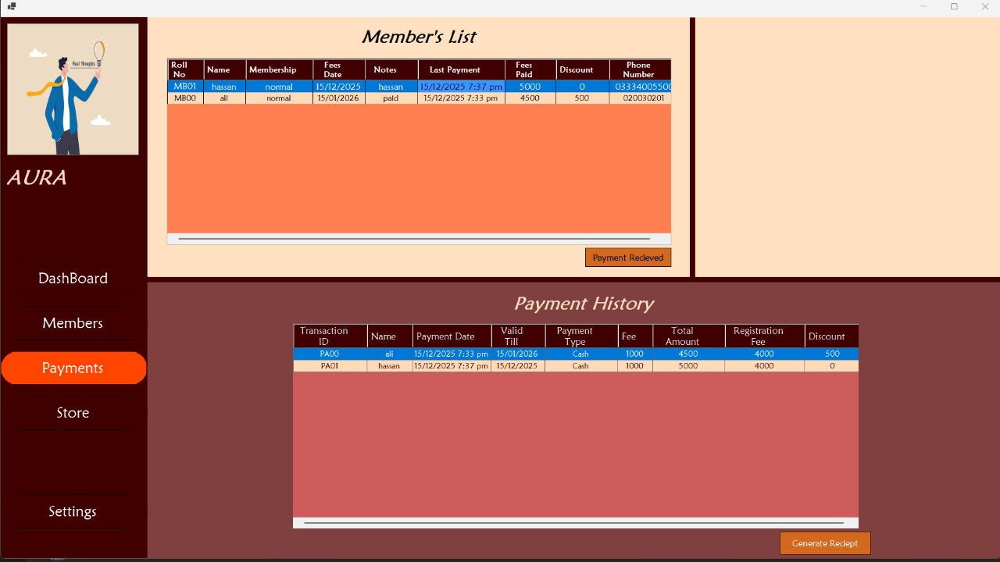
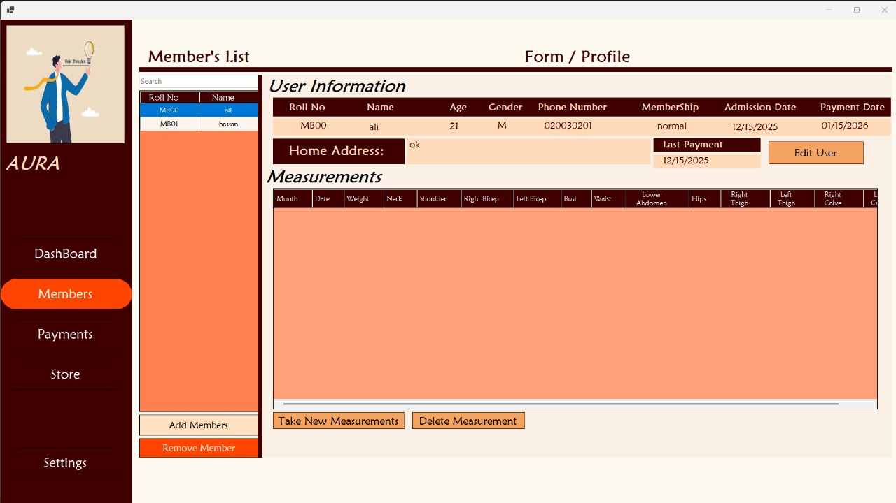
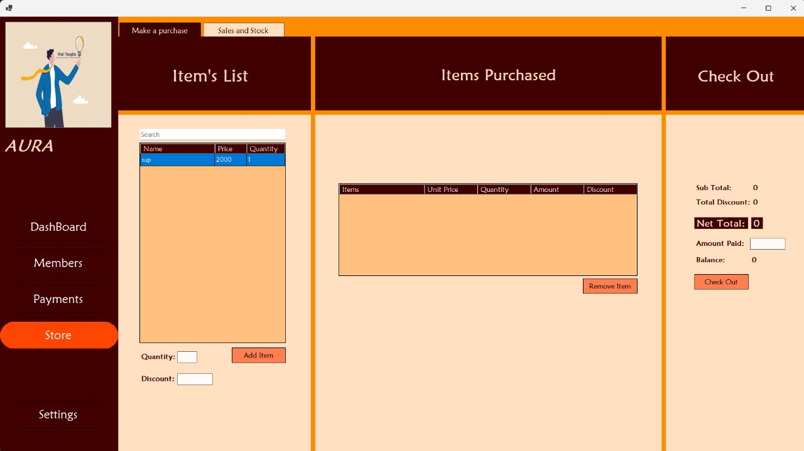
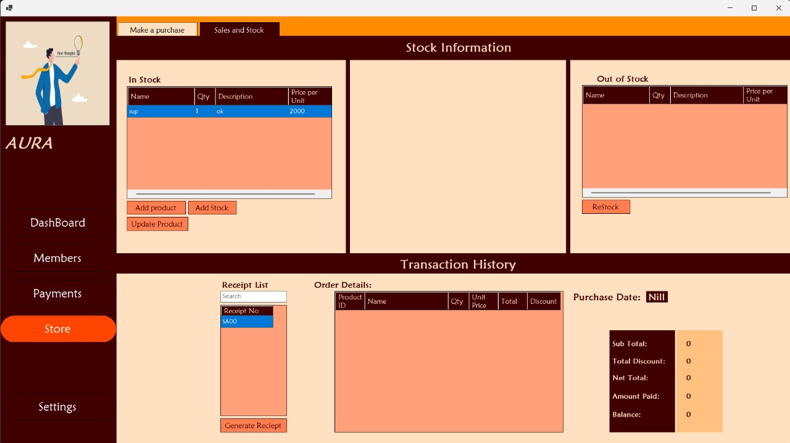

# Gym Management System

<p align="center">
  
</p>

Business-oriented gym management platform built with C# and .NET focused on membership operations, attendance tracking, subscription workflows, and administrative management.

## Overview

Gym Management System is a desktop-based business management application designed to streamline gym operations through centralized member management, attendance monitoring, subscription handling, and administrative operations.

The system focuses on maintainable architecture, structured workflows, and efficient administrative operations for fitness businesses.

## Features

### Member Management

* Member registration and profile management
* Membership status tracking
* Search and filtering workflows
* Secure member data organization

### Attendance Tracking

* Automated attendance workflows
* Daily attendance monitoring
* Attendance history records
* Operational tracking dashboard

### Subscription & Billing

* Membership subscription handling
* Billing management workflows
* Payment tracking system
* Membership renewal management

### Administrative Dashboard

* Centralized operational dashboard
* Member activity overview
* Subscription analytics
* System management workflows

## Engineering Highlights

* Modular business management workflows
* Structured member data handling
* Maintainable desktop application architecture
* Operational dashboard organization
* Role-oriented administrative workflows
* Optimized attendance and subscription management

## Tech Stack

### Application Development

* C#
* .NET Framework

### Database

* SQL Database System

### Tools

* Visual Studio
* Git & GitHub

## Architecture

```text id="e7q7b0"
Desktop Interface
       ↓
Business Logic Layer
       ↓
Authentication & Operations
       ↓
SQL Database System
```

## Screenshots







## Installation

### Clone Repository

```bash id="2fdmbj"
git clone https://github.com/syedasjadabbas/Gym-Management-System.git
```

### Open Project

```bash id="jlwmld"
Open solution file in Visual Studio
```

### Configure Database

* Setup SQL database connection
* Update connection string
* Run database initialization scripts

### Run Application

```bash id="k2m3m8"
Build and run the project from Visual Studio
```

## Project Structure

```text id="g4rjlwm"
Gym-Management-System/
├── UI/                     # Desktop interface
├── BusinessLogic/          # Core application logic
├── Database/               # Database operations
├── Models/                 # Data models
├── Utilities/              # Helper utilities
└── README.md
```

## Future Improvements

* Advanced analytics dashboard
* Cloud synchronization
* QR-based attendance system
* Automated notification workflows
* Role-based authentication enhancements

## Author

SYED ASJAD ABBAS

GitHub: @syedasjadabbas
